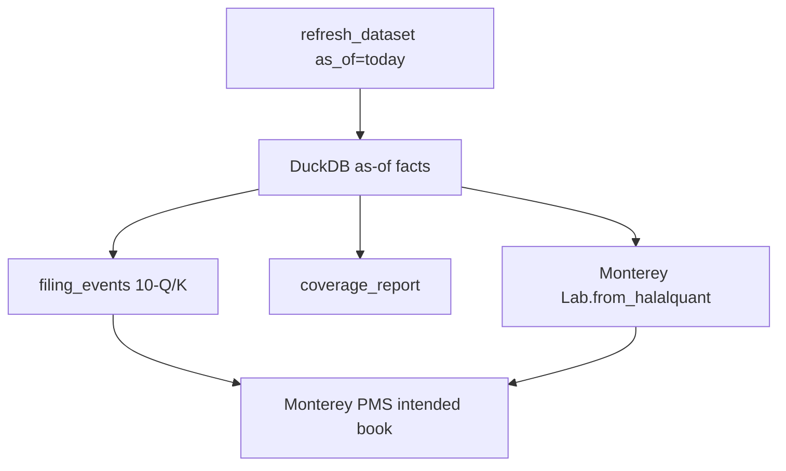

# Halalquant v2: as-of facts for the shadow fund

This plan is **this repo only**. Monterey [Research/sleeves](https://github.com/regional-specter/Monterey-Finance/tree/main/Research) already consumes `hq.get_financial_metrics` + `hq.download` via `Lab.from_halalquant`. The [shadow-fund loop](https://github.com/regional-specter/Monterey-Finance/tree/main/Backend%20%26%20Operations) is still README-only; its first job (target weights) should wrap these new APIs later, not live here.



**Keep DuckDB + Parquet under `~/.halalquant/`.** Fifteen years of S&P (current + leavers) daily bars plus quarterly filings is hundreds of MB, not a warehouse problem. The gap is *incremental append + PIT membership*, not a new store.

**Out of this library (do not pull over):** sleeve overlap, CVaR, SMA path ([`Monterey-Finance/Research/sleeves/diagnostics.py`](/Users/raoabdul/Documents/Development/Monterey-Finance/Research/sleeves/diagnostics.py)); PMS / OMS / paper broker / NAV; FMP, DJIM-as-product, non-US expansion, corporate-action calendar (item 6, after the success test).

**Library success test (from the screenshots):** `Lab.from_halalquant(...)` for **2010–today**, monthly FCF book, 2020 and 2022 still in sample, plus a coverage report you would show a Sharia reviewer.

---

## What 0.1 already does (and why it blocks the live book)

[`prepare_dataset()`](halalquant/database/_dataset.py) is a **cold warm**: current Wikipedia/CSV S&P 500, annual 10-K only (`ANNUAL_FORMS` in [`_sec_edgar.py`](halalquant/providers/_sec_edgar.py)), month-end snapshots from the latest **annual** filing. Cache “incremental” is incomplete:

- Prices: refetch a whole symbol if min/max is outside ±7 days; **interior holes and “yesterday’s bar” are invisible** ([`_missing_price_symbols`](halalquant/database/_cache.py)).
- Statements/dividends: once marked `*_fetched`, **never re-hit** until `force_refresh=True` — so a 10-Q last night never lands.
- Universe: [`universe_members`](halalquant/database/_models.py) PK is `(universe, symbol)` — **today’s winners only**.

`rebuild_metric_panels()` already rebuilds AAOIFI tables from cached filings with no network; refresh should use that pattern for *new stamps / new filings only*.

---

## Two focused releases (so this and Monterey do not fight)

### Release 0.2.0 — daily cache + compliance feed (unblocks the shadow fund)

**1. `refresh_dataset(as_of=today)`**

New public function next to `prepare_dataset` in [`halalquant/database/_dataset.py`](halalquant/database/_dataset.py) and [`halalquant/api.py`](halalquant/api.py). Cold start still calls `prepare_dataset`. Nightly jobs call refresh.

Behavior:

- **Prices:** for each cached symbol, fetch `[max(date)+1, as_of]` only (and symbols whose coverage start is after the requested start). Detect interior gaps, not just min/max.
- **Dividends:** same gap window; drop the “fetched once, never again” rule for the open end of the range.
- **Filings:** do **not** re-download every companyfacts blob. Use SEC submissions JSON (`data.sec.gov/submissions/CIK##########.json`) to find new `10-Q` / `10-K` / amendments since `max(filed_date)` in cache; set `refresh_facts=True` only for those CIKs; upsert new `(report_date, filed_date)` rows.
- **Metrics:** append calendar stamps after the last cached `as_of`; rebuild only symbols that got a new filing (reuse `rebuild_metric_panels` scoped by symbol/date).
- **Universe current list:** refresh today’s S&P snapshot for the *live* book without wiping PIT history (PIT table lands in 0.3).
- Return a compact summary: `n_new_bars`, `n_new_filings`, `n_new_dividends`, `n_facts_redownloaded`, per-symbol counts.

CLI: `python -m halalquant refresh --as-of today` (keep `prepare` for cold start / `--force-refresh`).

**2. Filing-event feed (not only month-end ratios)**

Add `form` + `fiscal_period` on `balance_sheets` / `income_statements` (migration in [`_models.py`](halalquant/database/_models.py) + [`_duckdb_driver.py`](halalquant/database/_duckdb_driver.py)). New table `filings`:

- `(symbol, cik, form, report_date, filed_date)` PK
- Written whenever companyfacts/submissions yield a 10-Q or 10-K

Public API:

```python
hq.filing_events(as_of="2026-09-25", since="2026-09-24", cache=True)
```

One row per new filing: ticker, form, `filed_date`, `report_date`, debt/cash/receivables vs **24m market cap as of filed_date**, `is_compliant`, `reason`. This is the payload Monterey paper 10 already reconstructs from month-end metrics via `unique_filings()` in [`exits.py`](/Users/raoabdul/Documents/Development/Monterey-Finance/Research/sleeves/exits.py). Live rule remains `breach_exit="next_open"` in Monterey; the library only emits as-of facts.

SEC parser: generalize `_iter_annual_points` into `_iter_filing_points(forms=...)` so 10-Q tags are stored. 0.2 can still *screen* on the latest known statement (10-Q balance sheet is enough for the breach feed) even before TTM FCF exists.

**3. Coverage report (data quality, not alpha)**

New [`halalquant/database/_coverage.py`](halalquant/database/_coverage.py) (or `utils/_coverage.py`), exported as `hq.coverage_report(...)`.

Rows/sections a Sharia reviewer can read:

- % names with FCF / OCF / CapEx
- % names with `impure_ratio` (interest/revenue)
- restated 10-Ks: multiple `filed_date` per `(symbol, report_date)`
- CIK map misses (US ticker, Yahoo fallback or empty)
- sector-map gaps
- 20-day median dollar ADV (from cached `volume * close`) for capacity honesty
- price/filing date span vs requested `[start, as_of]`

Do **not** implement Jaccard/CVaR/SMA here.

Tests: extend [`tests/test_cache.py`](tests/test_cache.py) with a fake provider that has yesterday missing, then a new 10-Q, and assert refresh fills only the gap and `filing_events` returns that CIK.

---

### Release 0.3.0 — quarterly PIT FCF + survivorship (makes 2010–today honest)

**4. Quarterly, point-in-time cash flow / FCF**

Yahoo annual FCF is why the book “goes live late” and history is short. Push SEC cash-flow tags onto **every 10-Q**:

- Same tags already mapped in [`_sec_edgar.py`](halalquant/providers/_sec_edgar.py) (`NetCashProvidedByUsedInOperatingActivities`, PP&E payments).
- Period FCF = OCF ± CapEx (existing `_free_cash_flow`).
- **TTM FCF / TTM revenue** = sum of last four *quarters already public* (`filed_date <= as_of`). If fewer than four quarters, fall back to latest 10-K annual FCF (today’s behavior).
- Month-end `freq="ME"` snapshots then carry TTM FCF on `free_cash_flow` so `Lab.fcf_panel()` keeps working with **no Monterey change**.
- Coverage: `% names with TTM FCF` in `coverage_report`.

No look-ahead: TTM windows use `filed_date`, not `report_date`. Restated comparatives keep the existing `(report_date, filed_date)` rows; PIT still picks the latest known filing.

**5. Longer history + point-in-time index membership**

Extend default `prepare` start from ~2018 toward **2010-01-01** (success-test gate). Schema should not block a later 2005 stretch.

Replace current-only membership:

- Reconstruct S&P 500 **stints** from the same Wikipedia page already used in [`_universe.py`](halalquant/database/_universe.py) (current list + historical changes table). Cache the result. Document that Wikipedia is “selected changes” — better than today’s list, not CRSP.
- New table `universe_stints (universe, symbol, start_date, end_date, sector, ...)` plus helper `list_universe("sp500", as_of=...)` and `list_universe("sp500", start=..., end=...)` (union of names that were in the index *at some month-end in the window*).
- Keep `universe="sp500"` as **current** members (live book, backward compatible). PIT is opt-in via `as_of` / `start`/`end`.
- `prepare_dataset(start="2010-01-01")` fetches prices/filings for the **union** of PIT members in that window (leavers included), not only today’s 500.

Delisted tickers that yfinance no longer serves show up as coverage holes, not silent drops. Full corporate-action/delist handling stays **after** 0.3 (screenshot item 6).

**6. Storage / load path for long panels**

No new database. Harden the existing cache:

- `export_parquet` / `import_parquet` already on [`LocalCache`](halalquant/database/_cache.py) — document a “research snapshot” workflow (copy `~/.halalquant/parquet/` into Monterey notebooks).
- Optional year-partitioned price parquet if a single `prices.parquet` gets unwieldy; DuckDB remains the query engine.
- `HALALQUANT_USE_CACHE=1` stays the default for Lab/PMS jobs.

---

## Public API surface (v2)

| Function | Role |
| --- | --- |
| `prepare_dataset(...)` | Cold warm (unchanged contract; longer default start in 0.3) |
| `refresh_dataset(as_of=...)` | Fill gaps only |
| `filing_events(as_of=, since=)` | New 10-Q/K + AAOIFI ratios vs 24m MC |
| `coverage_report(...)` | Data-quality dashboard |
| `list_universe("sp500", as_of=)` | PIT members (0.3) |
| existing `download` / `get_financial_metrics` / `get_halal_universe` | Cache-first; ME panel carries TTM FCF after 0.3 |

Bump [`__version__`](halalquant/__init__.py) / [`pyproject.toml`](pyproject.toml) to **0.2.0** then **0.3.0**. Update [`README.md`](README.md) What’s Next, [`USAGE.md`](USAGE.md) §8, [`main.todo`](main.todo), and CLI help.

---

## Monterey contract (implement there after 0.2)

Do not add PMS code to this library. After 0.2 ships, Monterey can:

1. Weekday job: `hq.refresh_dataset(as_of=last_session)` then `Lab.from_halalquant(symbols, start, end, cache=True)` then persist target weights (ticker, weight, cash %, SMA on/off, cap clips, why).
2. Intraday/session: `hq.filing_events(since=prior_session)` → next-open sells.
3. Only after 0.3: re-run papers 07–15 on the 2010–today PIT panel. If 2022 SMA-to-cash and the FCF funnel still hold, that is the paper track record. If not, you found out before dressing it up as a fund.

---

## Tests and docs

- Offline fake provider: gap-only price append; new 10-Q upsert; `force_refresh` still full rebuild.
- PIT: 10-Q `filed_date` after a month-end must not leak into that snapshot; TTM must ignore unfiled quarters.
- Universe: a name that left the index is absent from `list_universe(..., as_of=after_exit)` and present in the window union.
- Coverage: missing FCF / CIK miss / ADV column present.
- Keep live network tests in [`tests/test_sec_edgar.py`](tests/test_sec_edgar.py) for AAPL 10-Q points + original 10-K filed dates.
